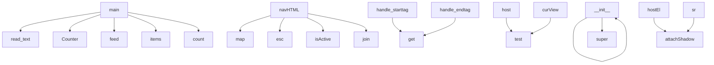

# System Architecture Analysis
<!-- generated in 0.00s -->

## Overview

- **Project**: /home/tom/github/if-uri/about-urirun-com
- **Primary Language**: shell
- **Languages**: shell: 3, python: 1, javascript: 1
- **Analysis Mode**: static
- **Total Functions**: 16
- **Total Classes**: 1
- **Modules**: 6
- **Entry Points**: 14

## Architecture by Module

### assets.ifuri-ecobar
- **Functions**: 12
- **File**: `ifuri-ecobar.js`

### scripts.check
- **Functions**: 4
- **Classes**: 1
- **File**: `check.py`

## Key Entry Points

Main execution flows into the system:

### scripts.check.main
- **Calls**: INDEX.read_text, Counter, parser.feed, parser.open.items, text.count, print, INDEX.is_file, print

### assets.ifuri-ecobar.navHTML
- **Calls**: assets.ifuri-ecobar.map, assets.ifuri-ecobar.esc, assets.ifuri-ecobar.isActive, assets.ifuri-ecobar.join

### scripts.check.Counter.__init__
- **Calls**: None.__init__, super

### scripts.check.Counter.handle_starttag
- **Calls**: self.open.get

### scripts.check.Counter.handle_endtag
- **Calls**: self.open.get

### assets.ifuri-ecobar.host
- **Calls**: assets.ifuri-ecobar.test

### assets.ifuri-ecobar.curView
- **Calls**: assets.ifuri-ecobar.test

### assets.ifuri-ecobar.hostEl
- **Calls**: assets.ifuri-ecobar.attachShadow

### assets.ifuri-ecobar.sr
- **Calls**: assets.ifuri-ecobar.attachShadow

### assets.ifuri-ecobar.params

### assets.ifuri-ecobar.lang

### assets.ifuri-ecobar.view

### assets.ifuri-ecobar.label

### assets.ifuri-ecobar.p

## Process Flows

Key execution flows identified:

### Flow 1: main
```
main [scripts.check]
```

### Flow 2: navHTML
```
navHTML [assets.ifuri-ecobar]
  └─> esc
```

### Flow 3: __init__
```
__init__ [scripts.check.Counter]
```

### Flow 4: handle_starttag
```
handle_starttag [scripts.check.Counter]
```

### Flow 5: handle_endtag
```
handle_endtag [scripts.check.Counter]
```

### Flow 6: host
```
host [assets.ifuri-ecobar]
```

### Flow 7: curView
```
curView [assets.ifuri-ecobar]
```

### Flow 8: hostEl
```
hostEl [assets.ifuri-ecobar]
```

### Flow 9: sr
```
sr [assets.ifuri-ecobar]
```

### Flow 10: params
```
params [assets.ifuri-ecobar]
```

## Key Classes

### scripts.check.Counter
- **Methods**: 3
- **Key Methods**: scripts.check.Counter.__init__, scripts.check.Counter.handle_starttag, scripts.check.Counter.handle_endtag
- **Inherits**: html.parser.HTMLParser

## Data Transformation Functions

Key functions that process and transform data:

## Public API Surface

Functions exposed as public API (no underscore prefix):

- `scripts.check.main` - 11 calls
- `assets.ifuri-ecobar.navHTML` - 4 calls
- `assets.ifuri-ecobar.esc` - 2 calls
- `scripts.check.Counter.handle_starttag` - 1 calls
- `scripts.check.Counter.handle_endtag` - 1 calls
- `assets.ifuri-ecobar.host` - 1 calls
- `assets.ifuri-ecobar.curView` - 1 calls
- `assets.ifuri-ecobar.isActive` - 1 calls
- `assets.ifuri-ecobar.hostEl` - 1 calls
- `assets.ifuri-ecobar.sr` - 1 calls
- `assets.ifuri-ecobar.params` - 0 calls
- `assets.ifuri-ecobar.lang` - 0 calls
- `assets.ifuri-ecobar.view` - 0 calls
- `assets.ifuri-ecobar.label` - 0 calls
- `assets.ifuri-ecobar.p` - 0 calls

## System Interactions

How components interact:



## Reverse Engineering Guidelines

1. **Entry Points**: Start analysis from the entry points listed above
2. **Core Logic**: Focus on classes with many methods
3. **Data Flow**: Follow data transformation functions
4. **Process Flows**: Use the flow diagrams for execution paths
5. **API Surface**: Public API functions reveal the interface

## Context for LLM

Maintain the identified architectural patterns and public API surface when suggesting changes.